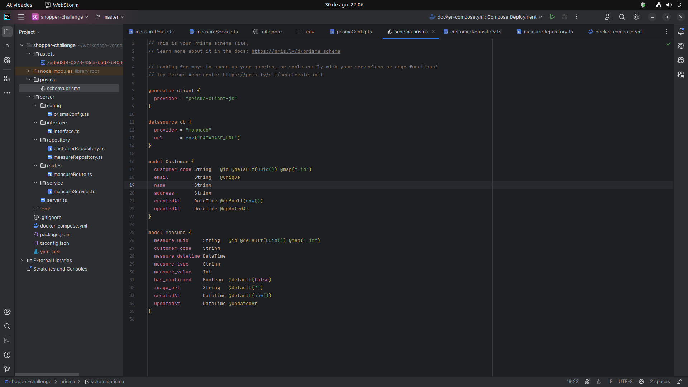
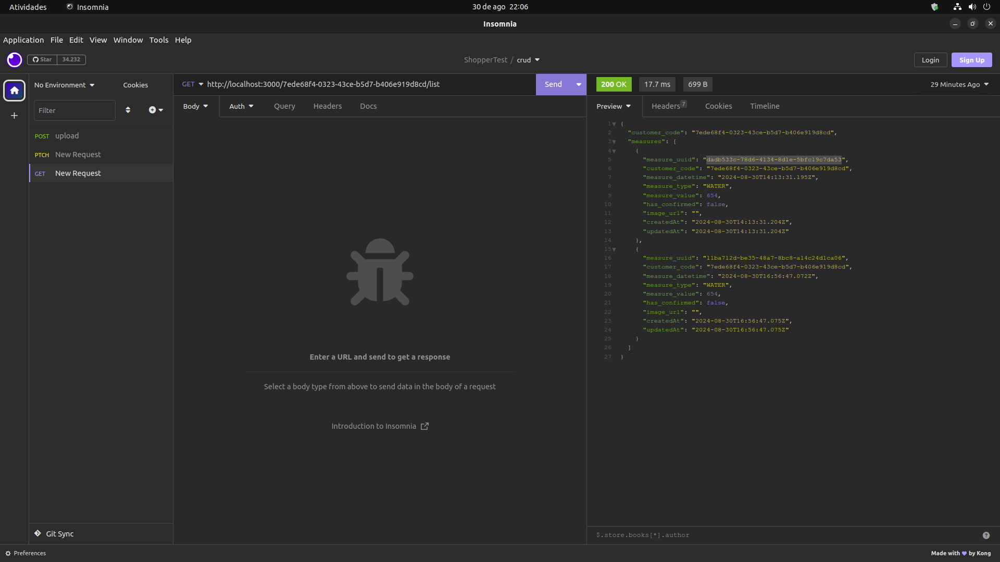

# Api rest em nodejs
Api rest em node.js, typescript, mongodb em docker e prisma ORM;

<h1 align="center">
    
    
</h1>

## 🚀 Motivaçao / objetivo

A motivação foi um convite para participar desse desafio técnico proposto pela [SHOPPER.COM](https://landing.shopper.com.br/).

## 💻 Requisitos

Antes de iniciar, você deve ter o Node.js e o NPM instalados em sua máquina.

## 🚀 Instalando

Primeiro, você deve clonar o projeto na sua máquina, para isso você
pode colar o seguinte comando em seu terminal

```bash
git clone https://github.com/Tiago-Silva/shopper-challenge.git
```
Para instalar as dependências, execute o seguinte comando:

```bash
npm install
```
ou

```bash
yarn install
```

Por fim, para executar o projeto basta rodar o seguinte:

```bash
yarn dev
```

### Features

Tecnologias usadas nesse projeto:

<!-- Ícones de tecnologias. Você pode encontrar esses ícones em sites como https://simpleicons.org/ -->
<p align="center">
  <a href="https://skillicons.dev">
    
  </a>
</p>


## 📝 Licença

Este projeto está licenciado sob a licença MIT. Consulte o arquivo `LICENSE` para obter mais informações.
